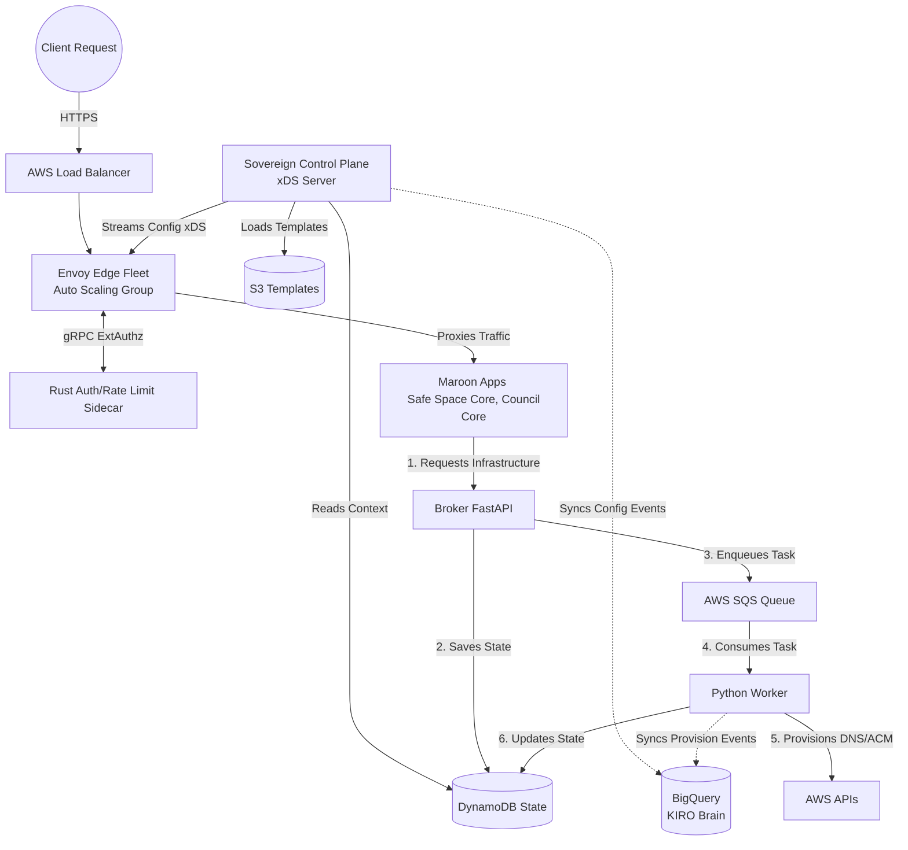

# Sovereign Edge Control Plane Architecture

The Maroon Edge Platform is a globally distributed edge routing mesh powered by Envoy proxies, an xDS Sovereign Control Plane, and async provisioning workers. This system forms the root infrastructure for the Maroon Ecosystem.

## Architecture Diagram

## BigQuery & Project KIRO Integration

This architecture natively integrates with **Project KIRO (The AWS IDE / Brain Repo)** and **BigQuery**.

- As infrastructure is requested and provisioned via the Broker/Worker layer, event states are synced directly to BigQuery.
- As the Sovereign Control Plane streams dynamic configurations to Envoy, the `cds_update` and `lds_update` events are logged to BigQuery.
- This creates a centralized, queryable ledger (Master Codex) of all infrastructure mutations, enabling the KIRO AI brain to analyze routing patterns, perform autonomous anomaly detection, and optimize edge configurations.
